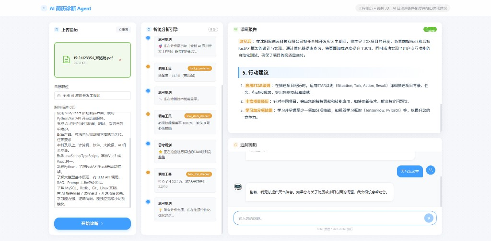

# AI 简历诊断助手

> 基于 ReAct Agent 架构的智能简历分析系统，支持 PDF 解析、职位匹配评估与多轮追问对话，全程流式输出。



---

## ✨ 功能特性

- **PDF 简历解析** — 自动提取结构化文本信息
- **ReAct Agent 分析** — 逐步推理（思考→工具调用→观察），过程实时可见
- **岗位匹配评估** — 对比 JD 自动评分，输出技能匹配度与短板分析
- **流式诊断报告** — Markdown 格式，逐字流式渲染
- **多轮追问对话** — 基于简历上下文，仅回答求职相关问题
- **刷新不丢状态** — 全部分析结果持久化到 localStorage

---

## 🛠 技术栈

| 层级 | 技术 |
|------|------|
| 前端框架 | Vue 3 + Vite |
| 前端状态 | Pinia（持久化到 localStorage）|
| 前端运行 | Vite Dev Server（`/api` 代理到后端）|
| 后端框架 | Python FastAPI |
| 流式协议 | SSE（Server-Sent Events）|
| AI Agent | ReAct 架构（自定义工具链）|
| 大语言模型 | GLM-4-Flash（智谱 AI）|
| 会话存储 | Redis（2h TTL 自动过期）|
| 运行方式 | 本地开发（前端 Vite + 后端 FastAPI） |

---

## 🏗 系统架构

```
浏览器
  │
  ├─ Vue3 + Vite Dev Server :5173
  │        │
  │        └─ /api/*（Vite Proxy）
  │
  └──────────────────────────────→ FastAPI :8011
                                   │
                        ReAct Agent + Redis Session/Cache
```

---

## 🚀 快速启动

### 前置条件

- Python 3.10+
- Node.js 18+

### 1. 克隆项目

```bash
git clone https://github.com/YOUR_USERNAME/resume-app.git
cd resume-app
```

### 2. 配置 API Key（后端）

```bash
# 复制示例文件
cp .env.example backend/.env

# 编辑 backend/.env，填入你的智谱 AI API Key
# 申请地址：https://open.bigmodel.cn/
```

`backend/.env` 内容示例：
```
ZHIPU_API_KEY=your_api_key_here
ZHIPU_BASE_URL=https://open.bigmodel.cn/api/paas/v4
ZHIPU_MODEL=glm-4-flash
ZHIPU_EMBEDDING_MODEL=embedding-3
REDIS_HOST=127.0.0.1
REDIS_PORT=6379
REDIS_DB=0
REDIS_PASSWORD=
```

### 3. 启动 Redis

```bash
docker run -d --name resume-redis -p 6379:6379 redis:7-alpine
```

### 4. 启动后端（FastAPI）

```bash
cd backend
pip install -r requirements.txt
python -m uvicorn app.main:app --host 0.0.0.0 --port 8011 --reload
```

### 5. 启动前端（Vite）

```bash
cd frontend
npm install
npm run dev
```

启动后访问：**http://localhost:5173**

### 6. 停止服务

```bash
# 前端/后端终端使用 Ctrl + C 停止
docker stop resume-redis
```

---

## 📁 项目结构

```
resume-app/
├── backend/                  # FastAPI 后端
│   ├── app/
│   │   ├── agents/
│   │   │   └── resume_agent.py   # ReAct Agent 核心逻辑
│   │   ├── api/
│   │   │   └── routes.py         # SSE 流式接口
│   │   ├── core/
│   │   │   ├── config.py         # Pydantic 配置管理
│   │   │   └── redis_client.py   # Redis 会话/缓存封装（TTL）
│   │   └── tools/
│   │       ├── pdf_parser.py     # PDF 解析工具
│   │       ├── jd_matcher.py     # JD 匹配工具
│   │       └── stack_checker.py  # 技术栈检查工具
│   ├── Dockerfile
│   └── requirements.txt
├── frontend/                 # Vue 3 前端
│   ├── src/
│   │   ├── api/index.js          # SSE 流式请求封装
│   │   ├── stores/resume.js      # Pinia 状态管理
│   │   └── components/
│   │       ├── ResumeUpload.vue  # 上传 & 触发分析
│   │       ├── AgentProcess.vue  # Agent 思考步骤展示
│   │       ├── ReportDisplay.vue # 诊断报告渲染
│   │       └── ChatBox.vue       # 追问对话框
│   ├── Dockerfile
│   └── vite.config.js
```

---

## 🔑 核心设计亮点

### 1. ReAct Agent 架构
Agent 在每一轮迭代中依次执行**思考（Thought）→ 工具调用（Action）→ 观察结果（Observation）**，逻辑清晰可追溯，前端实时展示每一步。

### 2. SSE 流式输出
使用 HTTP SSE 协议（而非 WebSocket）实现服务端到客户端的单向数据推送，无需握手升级，天然兼容 HTTP/2，适合"服务端持续推送、客户端只读"的场景。

### 3. Redis 会话隔离
每个用户分配唯一 `session_id`（UUID），对话历史存入 Redis（`resume:session:{id}`），PDF 解析结果单独缓存（`resume:cache:{id}`），2 小时自动过期。

### 4. Vue 3 响应式持久化
分析结果（Agent 步骤、诊断报告、聊天记录）写入 `localStorage`，刷新页面无需重新分析，解决 SPA 状态丢失问题。

---

## 📝 License

MIT
